<p align="center">
  
</p>

<h1 align="center">ChalkTalk</h1>

<p align="center"><strong>Draws on your screen and guides you step by step.</strong></p>

<p align="center">
  <a href="https://drive.google.com/file/d/1tyDAC3urIA2XVTGFPTeudc7vWEQE5GWY/view?usp=sharing"><strong>Watch the demo →</strong></a>
  &nbsp;·&nbsp;
  <a href="#running-it">Run it locally</a>
  &nbsp;·&nbsp;
  <a href="#testing">How it's tested</a>
</p>

<p align="center">
  <a href="https://drive.google.com/file/d/1tyDAC3urIA2XVTGFPTeudc7vWEQE5GWY/view?usp=sharing">
    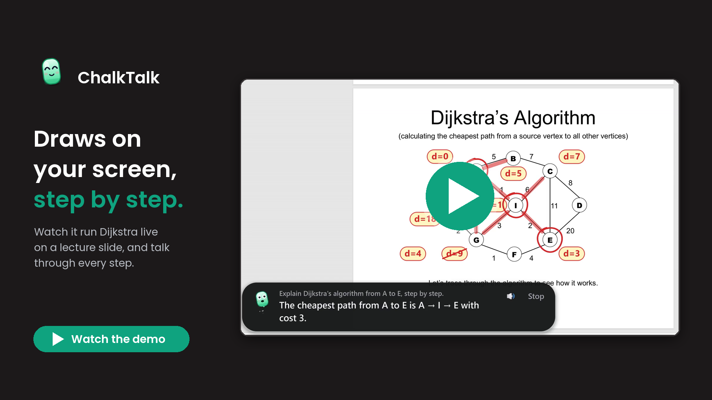
  </a>
  <br />
  <sub><em>▶ Watch the demo: ChalkTalk runs Dijkstra live on a lecture slide, drawing and explaining every step.</em></sub>
</p>

<br />

---

## Stuck on your screen? That happens every week

You're working through a lecture slide, a PDF or a YouTube lesson, and one thing doesn't make sense: a formula, a graph, a step in an algorithm. The answer is right there on the screen. The *explanation* isn't.

So you paste a screenshot into a chat. You get a wall of text in another window, and you have to map every sentence back onto the picture yourself. Next week it happens again.

<p align="center">
  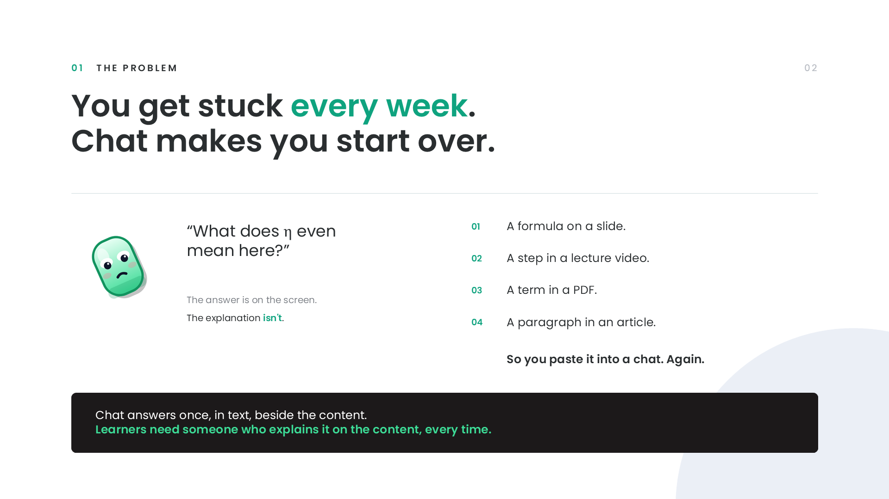
</p>

What you actually want is a teacher who walks up to the board, points at the exact thing and explains it, one step at a time. **ChalkTalk is that teacher, on any screen.**

---

## Why an agent, not a chat

Before building anything, I looked at what already exists. Copilot can see your screen and talk about it. Copilot Studio templates are good at questions over documents. Screen-share assistants talk, and subject tutors teach inside their own content. None of them draw **on** the slide, PDF or video you're actually using.

<p align="center">
  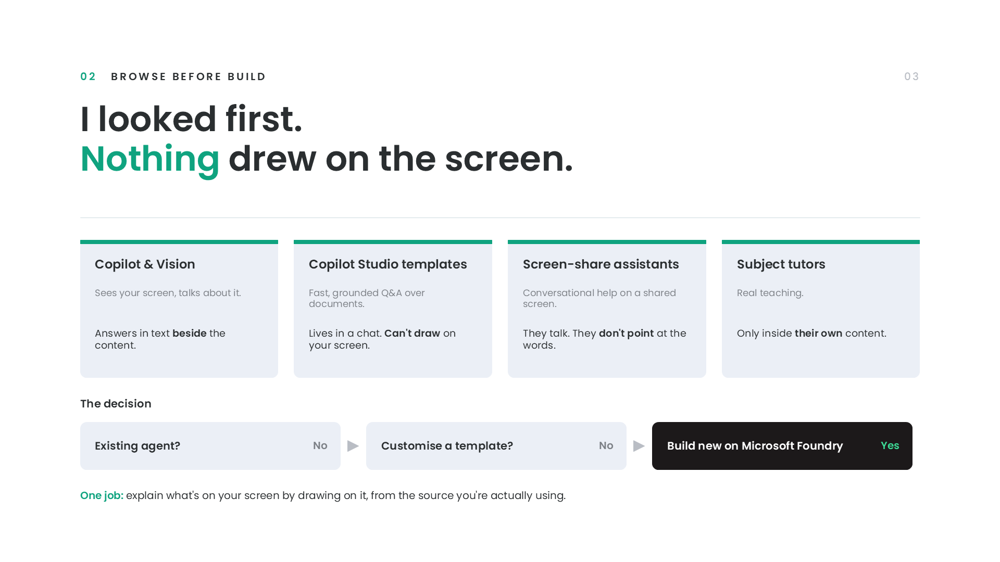
</p>

---

## What ChalkTalk does

<p align="center">
  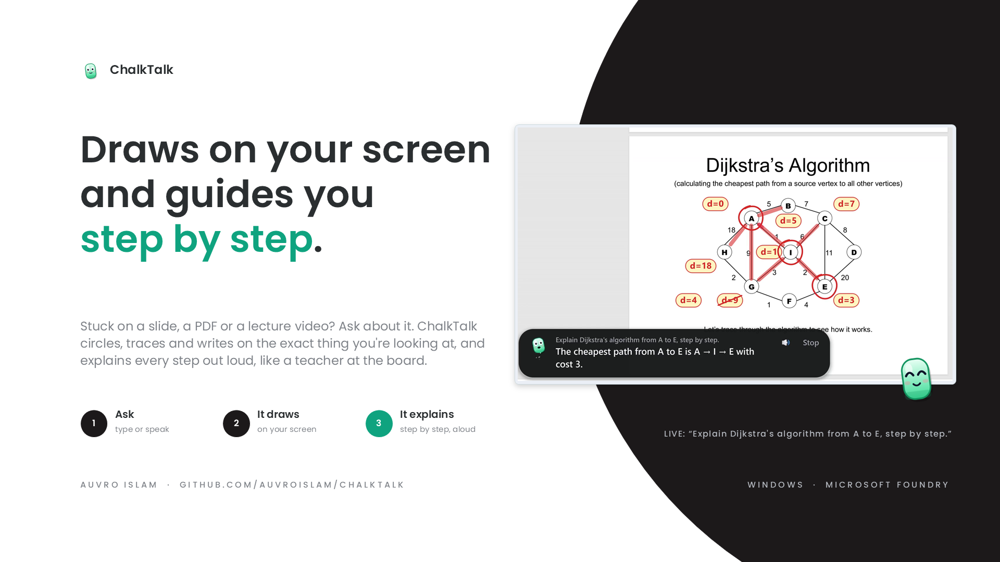
</p>

Press one hotkey over anything (a slide, a PDF, a YouTube lecture, code, a web page), then type or say your question. ChalkTalk:

- **marks the exact thing:** circles, underlines, arrows and edge traces, anchored to text and shapes it has measured;
- **explains step by step, aloud:** a short handwritten note beside each mark, and a spoken line for every step; the next step waits until the voice finishes;
- **knows what's open:** the video, PDF or web page behind the screen is its source, and it cites it.

<p align="center">
  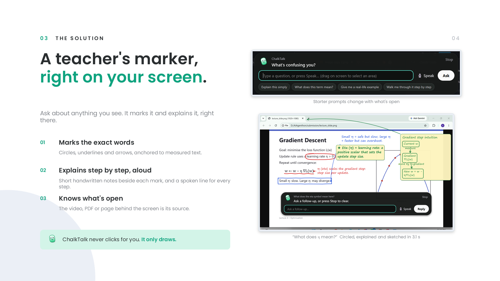
</p>

### Live walkthroughs

Ask *"Explain Dijkstra's algorithm from A to E"* or *"walk me through it"*, and ChalkTalk actually runs the algorithm on your screen, step by step:

| 1. Starts at A | 2. Finds a better route | 3. Stops at the target |
|---|---|---|
| 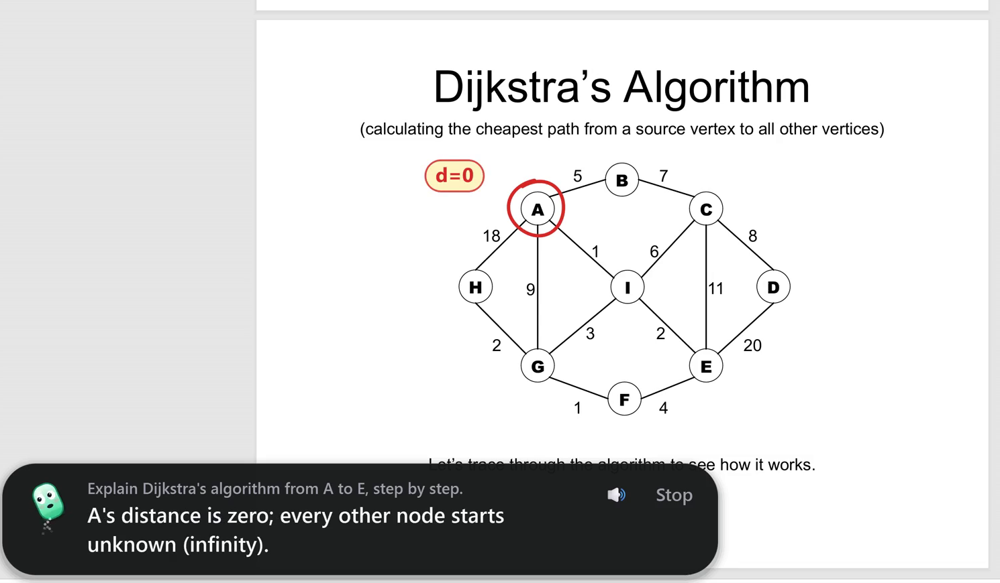 | 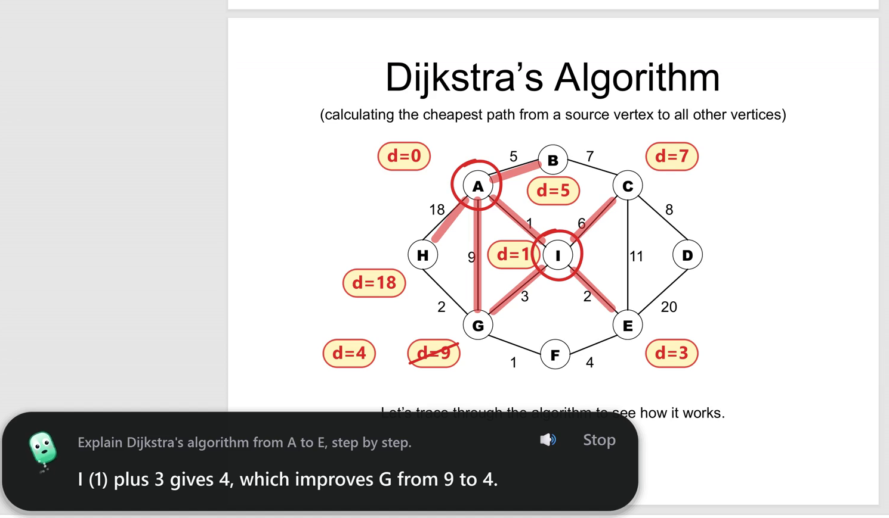 | 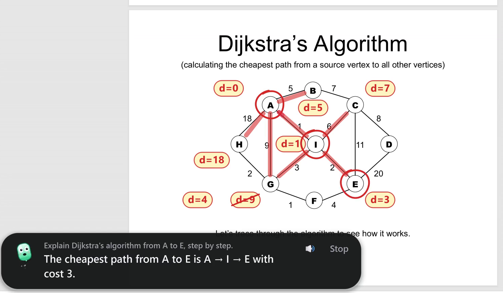 |
| Circles A and writes d = 0. | Through I: 1 + 3 = 4 beats 9, so G's old value is crossed out. | E is settled at 3; the path A → I → E is drawn in red. |

**It reads the real graph off the slide:** every node, every drawn line between two nodes, and the weight written on it (14 of 14 edges on this slide). The model only gets those edges, and ChalkTalk refuses to trace an edge that isn't in the picture. It also walks through BFS, sorting and algebra.

---

## How it works

<p align="center">
  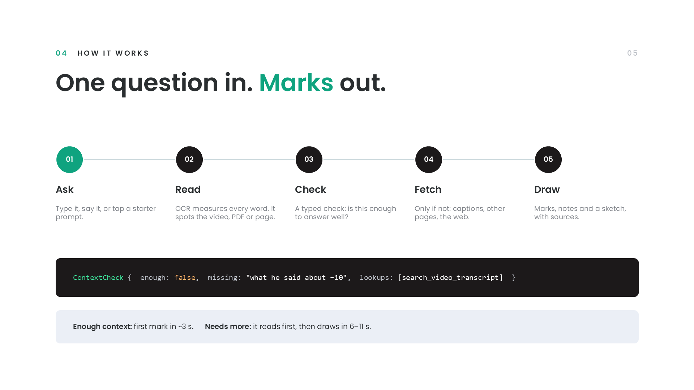
</p>

ChalkTalk is one agent made of five parts that hand off to each other:

| Part | What it does |
|---|---|
| **Eyes** | Screenshot + Windows OCR with word boxes. It recovers what OCR skips (a graph's node letters and edge weights), reads a graph's edges from its drawn lines, and splits hand-drawn sketches into marks by ink colour. |
| **Checker** | A typed `ContextCheck {enough, missing, lookups, cannot_know}` runs in parallel with drawing: is the screen enough, or does it need the video's captions, another page, or a web search? |
| **Planner** | GPT-5-mini on Microsoft Foundry. It streams the lesson one action at a time (circle, trace, tag, note, diagram), each with a sentence to say. |
| **Placement** | Puts every mark right beside what it explains (on a readable card if it covers text), never on the target or on another mark. Ink colours are picked for contrast. |
| **Voice** | Speaks each step with a Windows voice, offline. Drawing is paced like a hand, and the next step waits for the voice. |

**The model never guesses pixels.** It points at things the app has already found: text-line ids, graph nodes, or a described mark (*"the red arrow pointing right"*). The code turns those into exact positions.

### Getting enough context before explaining

| On screen | How it's recognised | Loaded up front | Tools the model can call |
|---|---|---|---|
| YouTube video | Browser address bar (UI Automation) | Title, channel, description, captions around the current time | `get_video_transcript`, `search_video_transcript` |
| PDF / PPTX / DOCX on your device | `file:///` URL, or the window title of Acrobat, PowerPoint, Word… | The page on screen and the pages around it | `read_document_pages`, `search_document` |
| Any web page | Address bar | Title and URL | `read_webpage` |
| Anything | – | – | `web_search` (Firecrawl) |

If the check says *not enough*, the drawings held back so far are thrown away unseen, the lookups run, and the answer is drawn with the new context, citing *(video 11:02)*, *(p. 4)* or *(en.wikipedia.org)*. Transcripts, document passages and page sections are embedded (`text-embedding-3-small`), so a question about "variants" finds the section called "Momentum".

---

## The parts that were actually hard

<p align="center">
  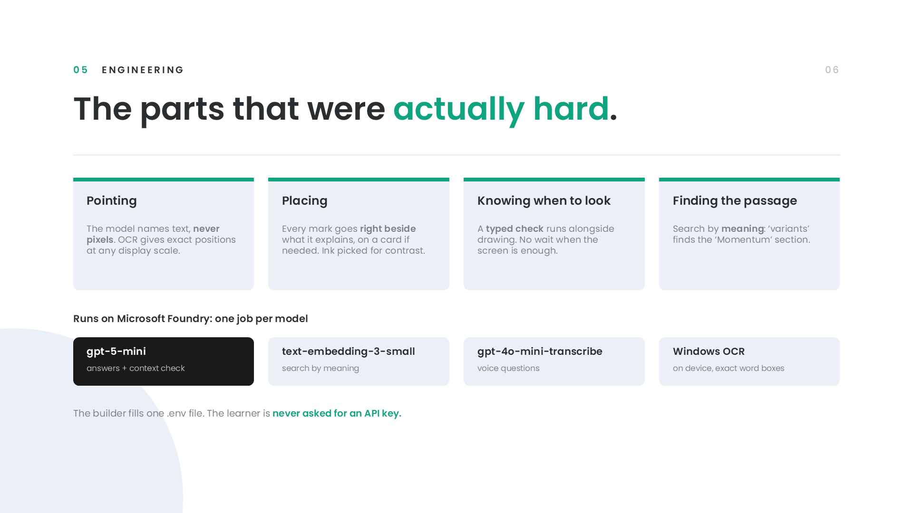
</p>

---

## Trust & honesty

<p align="center">
  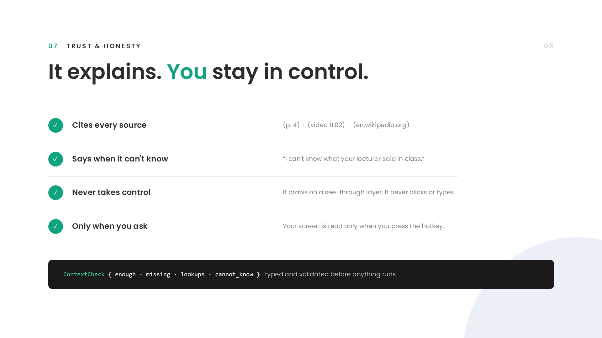
</p>

- **Cites every source** it fetched: *(p. 4)*, *(video 11:02)*, *(en.wikipedia.org)*.
- **Says when it can't know:** *"I can't know what your lecturer said in class."*
- **Never takes control:** it draws on a see-through layer and never clicks or types.
- **Only when you ask:** your screen is read only when you press the hotkey.

---

<a id="testing"></a>
## Tested, not hoped

<p align="center">
  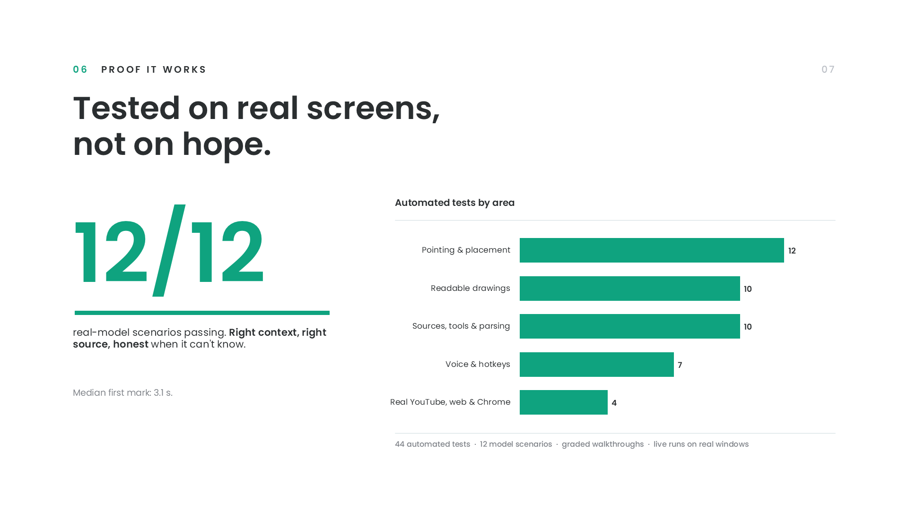
</p>

Every fix was measured with automatic graders, on cases other than the one that broke:

```
python -m pytest tests/test_offline.py tests/test_voice.py -q   # 44 tests: placement, OCR recovery, graph edges, figure marks, voice, parsing
python -m pytest tests/test_network.py -q   # YouTube, Firecrawl, a real Chrome window
python tests/eval_model.py                  # 12 real-model scenarios: context decision, citations, honesty, language, speed
python tests/eval_walkthroughs.py out_dir   # new graphs (letters, numbers, dark), BFS, sorting, algebra: graded against the true answer
python tests/live_e2e.py out_dir            # real browser windows end to end, with screenshots
```

Testing is what caught the real problems. On a real PDF in the browser, ChalkTalk first read only 5 of the 9 nodes, because browser icons were confusing the letter reader. Once, the model traced an edge that doesn't exist. The fixes (reading tokens by screen area, and reading edges from the drawn lines) were then checked on every test graph, not only that slide.

---

## Demo

<p align="center">
  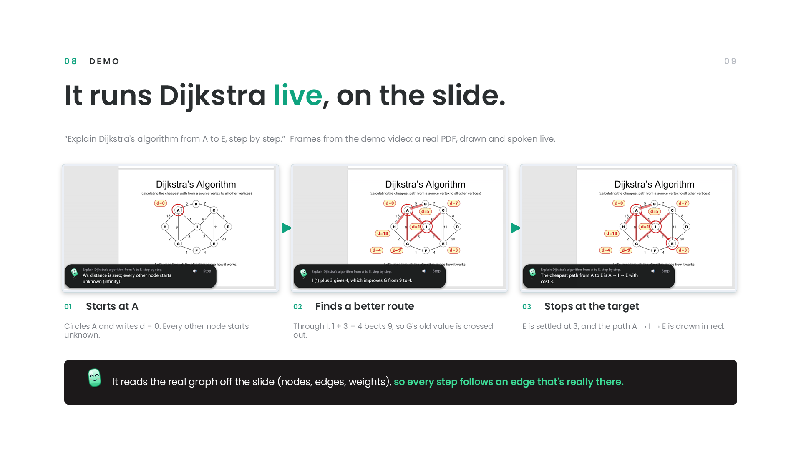
  <br />
  <sub><em><a href="https://drive.google.com/file/d/1tyDAC3urIA2XVTGFPTeudc7vWEQE5GWY/view?usp=sharing">▶ Watch the demo video</a> (or <a href="docs/ChalkTalk_Dijkstra_Demo.mp4">the raw recording</a>): a real PDF, drawn and spoken live, on Microsoft Foundry.</em></sub>
</p>

---

<a id="running-it"></a>
## Running it

Windows 10/11, Python 3.12.

```
pip install -r requirements.txt
copy .env.example .env      # add your Azure OpenAI (Microsoft Foundry) endpoint and key; Firecrawl key for the web
python main.py
```

- **Ctrl+Shift+Space:** type a question (optionally drag around the part that confuses you).
- **Ctrl+G:** just ask out loud. It stops listening when you pause; saying "stop" or "never mind" closes it.
- **Stop** ends a recording, otherwise stops the lesson, otherwise closes. 🔊 mutes the voice.
- **Microsoft Foundry:** set `AZURE_OPENAI_ENDPOINT`, `AZURE_OPENAI_API_KEY` and `CHALK_MODEL` (your deployment name). A stronger model via OpenAI is a one-line switch, described in `.env.example`.
- **No key:** `python main.py --demo` draws a canned explanation, so you can try the overlay.
- **OCR language pack:** Windows OCR needs one (English is normally installed): Settings › Time & language › Language › English › Language options › OCR.

## Files

| File | What it does |
|---|---|
| `main.py` | App flow: hotkey → capture + context → ask → stream → draw and speak |
| `window.py`, `capture.py`, `hotkey.py` | Foreground app and exact browser URL; screenshot of the monitor under the mouse; global hotkeys |
| `ocr.py` | Windows OCR with word boxes, plus recovery of lone letters and numbers (graph nodes and weights) |
| `layout.py` | Screen geometry: reading order, figures, graph edges, drawn marks, placement, colours, pointer routing |
| `context.py` | Sources (YouTube, documents, web pages), digests, typed tools, Firecrawl, embeddings |
| `planner.py`, `clients.py`, `config.py` | Prompt, typed context check, tool loop, streaming parser; the Foundry client; settings |
| `compose.py`, `items.py` | Turns actions into placed, animated, hand-drawn marks |
| `overlay.py`, `mascot.py` | The see-through drawing layer, the bar, and Chalky the mascot |
| `narrator.py`, `voice.py` | The spoken teacher voice; voice questions (recording and speech-to-text) |
| `render_test.py`, `selftest.py` | Offline render check; drives the real overlay and screenshots it |

---

<p align="center">
  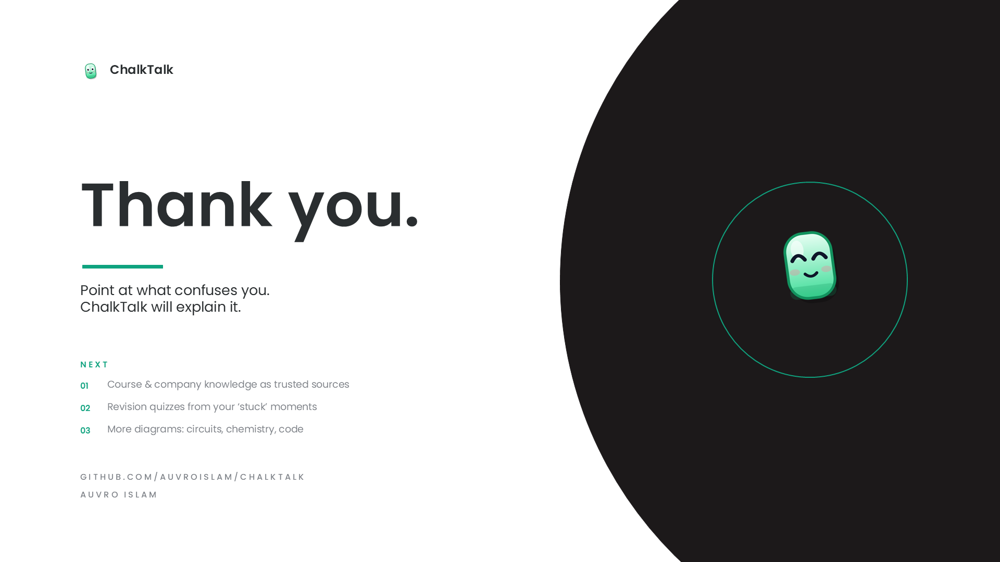
</p>
